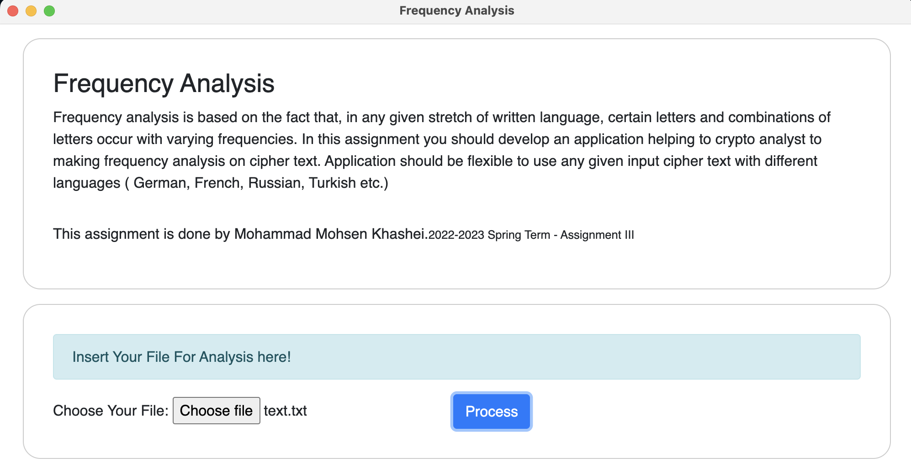
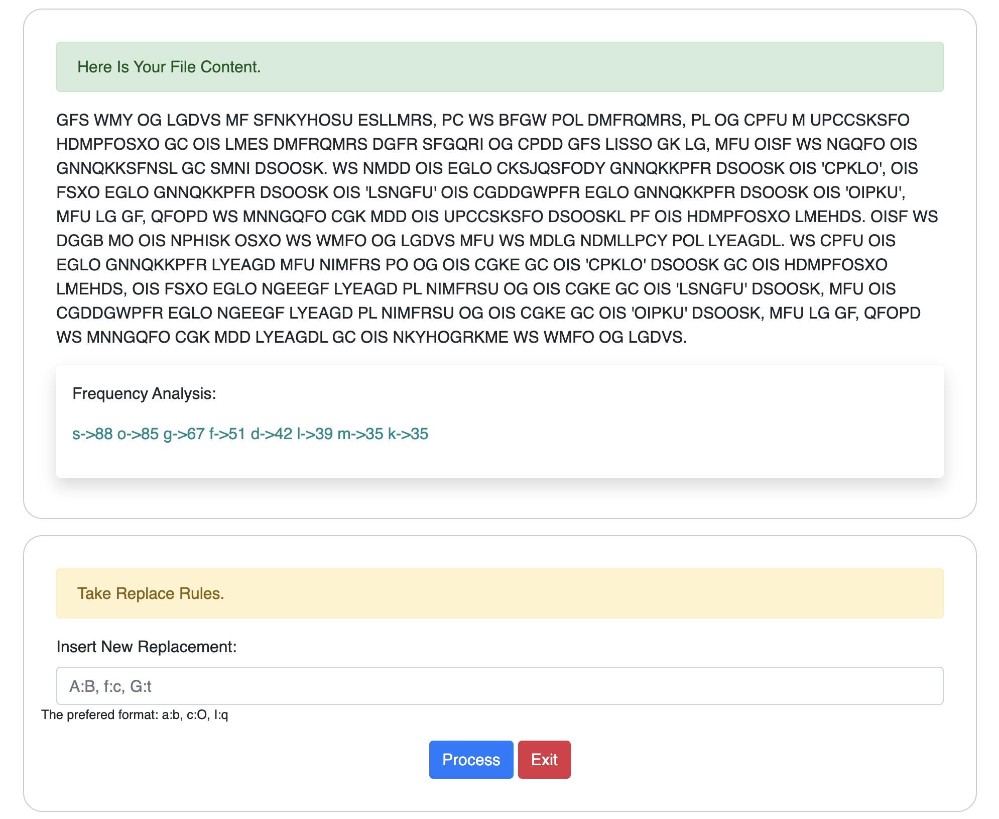
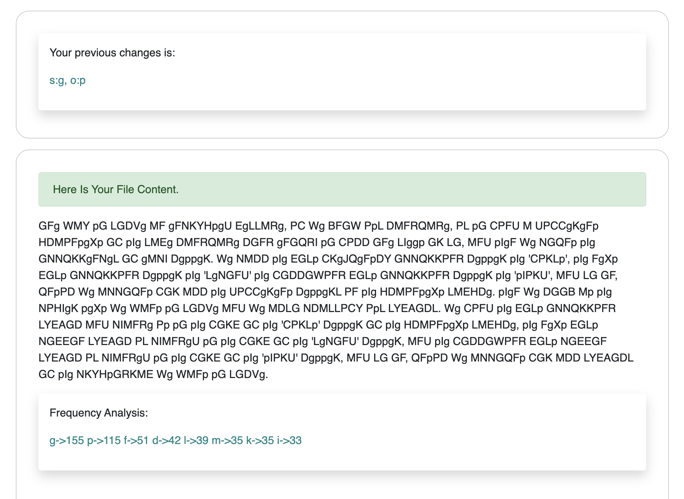

# Frequency Analysis

Frequency analysis is based on the fact that, in any given stretch of written language, certain letters and combinations of letters occur with varying frequencies. In this assignment you should develop an application helping to crypto analyst to making frequency analysis on cipher text. Application should be flexible to use any given input cipher text with different languages ( German, French, Russian, Turkish etc.)

## Demo





## Files structure

- `package.json` - Points to the app's main file and lists its details and dependencies.
- `main.js` - Starts the app and creates a browser window to render HTML. This is the app's **main process**.
- `index.html` - A web page to render. This is the app's **renderer process**.
- `preload.js` - A content script that runs before the renderer process loads.
- `core/tools/index.js` - Is the handler between Electron and NodeJS.
- `core/tools/frequencyAnalysis.js` - Is the core of the app that written in NodeJS and do the Frequency Analysis
- `core/tools/SQLite3Module.js` - Is the wrapper class on SQLlite DB.

## For Use

Inside Folder `executable` you will find the executable file for your OS.

```bash
# Clone this repository
git clone https://github.com/mohsenkhashei/textFrequencyAnalysis
# Go into the repository
cd textFrequencyAnalysis
# Install dependencies
npm install
# Run the app
npm start
```

## For Developing

To clone and run this repository you'll need [Git](https://git-scm.com) and [Node.js](https://nodejs.org/en/download/) (which comes with [npm](http://npmjs.com)) installed on your computer. From your command line:

```bash
# Clone this repository
git clone https://github.com/mohsenkhashei/textFrequencyAnalysis
# Go into the repository
cd textFrequencyAnalysis
# Install dependencies
npm install
# Run the app
npm start
```

Note: If you're using Linux Bash for Windows, [see this guide](https://www.howtogeek.com/261575/how-to-run-graphical-linux-desktop-applications-from-windows-10s-bash-shell/) or use `node` from the command prompt.

## This App created by

- Electron
- NodeJS
- SQLITE3
- JAVASCRIPT
- HTML
- CSS

## Authors

- [@mohsenkhashei](https://www.github.com/mohsenkhashei)

## License

[CC0 1.0 (Public Domain)](LICENSE.md)
